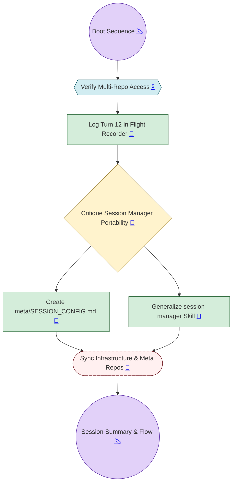

---
tags:
  - ai_text
  - conversation_flow
  - mapping
  - infrastructure
date_created: 2026-02-22
---

# 🐙 2026-02-22_153500-conversation-flow

> [!ABSTRACT] Session Overview: Infrastructure Hardening
> **Goal:** Test and generalize the `session-manager` skill for cross-project portability.
> **Active Skills:** `session-manager (v1.0.1)`, `git-flow-automator`, `project-maintainer`, `conversation-flow`, `obsidian-chat-summary`.
> **Environment:** Assistant System (Infra + Meta + Vault).

## 📝 Textual Breakdown

### 1. The Boot Sequence
The session began with the first live test of the `session-manager` skill. It successfully navigated the symlinked `meta/` directory and confirmed the multi-repo state.

### 2. The Critique & Pivot
The user identified that the `session-manager` was too tightly coupled to the Assistant project's specific paths. 
- **Decision:** Shift to a manifest-driven architecture using `SESSION_CONFIG.md`.
- **Decision:** Formalize the role of "Session Secretary" for the `session-manager`.

### 3. Implementation
- **meta/SESSION_CONFIG.md:** Deployed as the project's "boot parameters" file.
- **Skill Refactor:** The `session-manager` instructions were updated to dynamically parse the manifest, making the skill portable across any Gemini workspace.

### 4. Sync & Conclusion
Changes were committed to the `assistant` (Infra) and `meta` repositories. The session concluded with the generation of this narrative map.

## 🔗 Decisions & SHAs
- **Infra SHA:** `f421fa9`
- **Meta SHA:** `52e5438`
- **Architecture:** Portable, manifest-driven session initialization.
